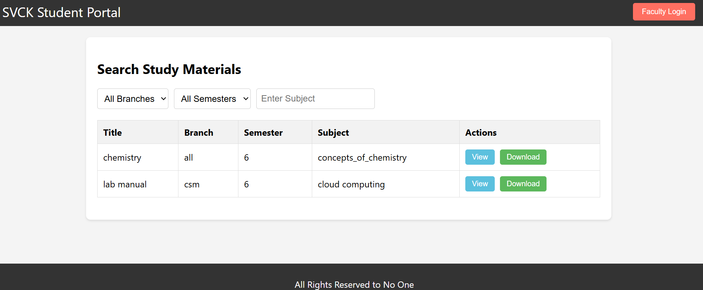
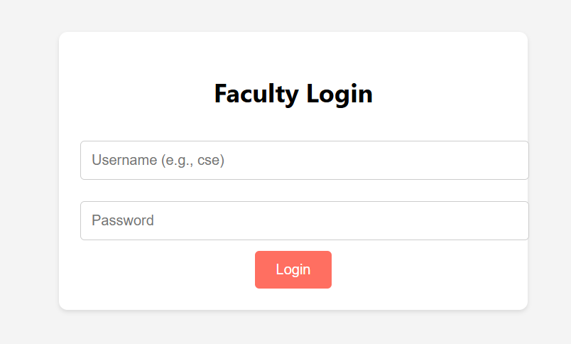
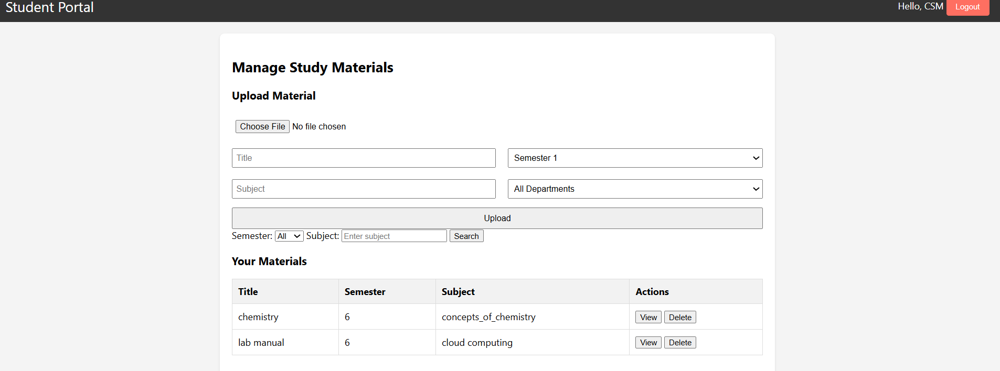

# SVCK Digital Library

SVCK Digital Library is a web-based study material portal designed for students and faculty. Faculty members can securely upload and manage study materials, while students can browse and download them easily.

## Features
- Secure faculty login with department-based access.
- AWS S3 storage for study materials.
- Students can search, filter, and download materials.
- Faculty can upload, view, and delete materials.
- Hosted on AWS EC2 with MySQL database.

---

## Installation Guide

### 1. Clone the Repository
```bash
git clone https://github.com/SHAIKSHOAIB-GIT/svck-digital-library.git
cd svck-digital-library
```

### 2. Create a Virtual Environment (Optional but Recommended)
```bash
python -m venv venv
source venv/bin/activate  # On Windows use: venv\Scripts\activate
```

### 3. Install Dependencies
```bash
pip install -r requirements.txt
```

### 4. Configure the Application
Create a `config.py` file inside the project directory:

```python
import os

AWS_ACCESS_KEY = os.getenv("AWS_ACCESS_KEY")
AWS_SECRET_KEY = os.getenv("AWS_SECRET_KEY")
S3_BUCKET_NAME = "your-s3-bucket-name"

DB_HOST = "your-database-host"
DB_USER = "your-database-user"
DB_PASSWORD = "your-database-password"
DB_NAME = "your-database-name"
```

Alternatively, you can set environment variables:
```bash
export AWS_ACCESS_KEY=your_access_key
export AWS_SECRET_KEY=your_secret_key
export DB_HOST=your_database_host
export DB_USER=your_database_user
export DB_PASSWORD=your_database_password
export DB_NAME=your_database_name
```

### 5. Run the Application
```bash
flask run
```
By default, the app will be available at: `http://127.0.0.1:5000/`

---

## Deployment on AWS EC2

1. **Launch an EC2 Instance** (Ubuntu recommended)
2. **Install Dependencies:**
   ```bash
   sudo apt update
   sudo apt install python3 python3-pip python3-venv mysql-server -y
   ```
3. **Clone Repository & Setup Virtual Environment** (as mentioned above)
4. **Run the Application using Gunicorn & Nginx**

---

## Screenshots




---

## Contributing
Feel free to submit issues and pull requests.

---

## License
This project is licensed under the MIT License.


